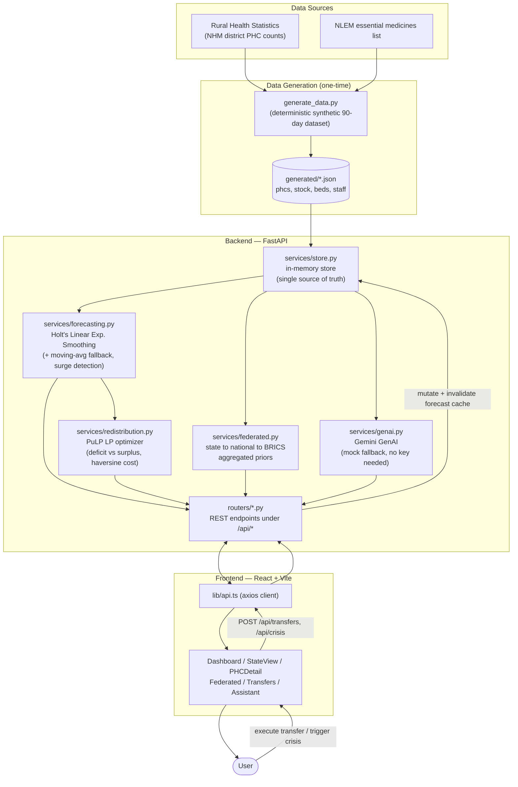

# SetuHealth — Federated National PHC Resource Grid

A federated AI platform for national-scale health resource and supply chain
management: real-time visibility into medicine stock, bed availability, and
staff attendance across a country's Primary Health Centre (PHC) network —
with predictive stockout forecasting, automated cross-district redistribution
recommendations, a multilingual/voice GenAI assistant, and a federated
learning layer designed to extend shared predictive modelling across BRICS
nations without any facility- or patient-level data crossing a border.

## Brief description

SetuHealth gives national health ministries real-time, forecasted visibility
into every PHC's medicine stock, beds, and staff — flagging stockouts before
they happen and recommending exactly which facility should send supplies to
which. A federated layer lets states, and eventually BRICS partner nations,
share only aggregated model statistics, never raw records.

## Architecture

```
frontend/  React + TypeScript + Vite + Tailwind + Recharts + Leaflet
backend/   FastAPI (Python) — data, forecasting, redistribution, federated
           aggregation, and Gemini-powered GenAI endpoints
```



- **Data**: a deterministic synthetic dataset (`backend/app/data/generate_data.py`)
  of 150+ PHCs across 6 real Indian states / 24 districts, 12 essential
  medicines (from India's NLEM), and 90 days of daily stock/bed/staff history
  with realistic seasonal demand spikes (e.g. anti-malarials in monsoon) and
  a subset of facilities deliberately under supply stress — so forecasting
  and redistribution have real signal to act on. Per-district facility
  counts are not arbitrary: they're generated proportionally from the real
  number of functioning PHCs in each district, per the Ministry of Health &
  Family Welfare / National Health Mission's official [Rural Health
  Statistics — District-wise Availability of Health Centres in India](https://www.nhm.gov.in/images/pdf/monitoring/rhs/district-wise-health-centres.pdf)
  (`backend/app/data/reference.py::REAL_PHC_COUNTS`), scaled to 10% of the
  real counts so the demo stays fast and the map stays legible — the same
  generator scales linearly to the full real counts (and the full ~1.6 lakh
  PHC network) given real operational data feeds.
- **Forecasting** (`backend/app/services/forecasting.py`): fits Holt's Linear
  Exponential Smoothing (statsmodels, additive trend) over each PHC/medicine's
  consumption history to project 14 days ahead, falling back to a trailing
  14-day moving average when history is too short or the fit fails —
  computing days-to-stockout and flagging `critical` (≤7 days) / `warning`
  (≤14 days) risk, plus separate surge detection comparing recent vs baseline
  consumption. Results are cached and invalidated whenever the store mutates.
- **Redistribution** (`backend/app/services/redistribution.py`): solves a
  linear program (PuLP, CBC solver) per medicine that splits PHCs into
  deficit and surplus pools and picks transfers minimizing unmet deficit and
  haversine-distance transport cost (with penalties for cross-district/
  cross-state moves), capped by what the donor can spare and what the
  recipient needs.
- **Federated layer** (`backend/app/services/federated.py`): each state node
  computes local category-level summary statistics; the national server
  federated-averages them (weighted by facility count) into a national
  prior. The same mechanism is demonstrated combining with synthetic partner
  nodes (Brazil, South Africa, and observer nations) into a BRICS-wide
  shared prior — only aggregates ever cross a node boundary.
- **GenAI** (`backend/app/services/genai.py`): Google Gemini generates
  plain-language stockout explanations and powers a chat assistant answering
  questions about the live network, in English or Hindi (extensible to any
  language), with browser-based voice input/output. Runs in a graceful
  offline mock mode with no API key so the app is fully demoable before a
  key is provisioned.

## Running locally

### Backend

```bash
cd backend
python3.12 -m venv .venv && source .venv/bin/activate
pip install -r requirements.txt
python3 -m app.data.generate_data   # builds the synthetic dataset (one-time)
cp .env.example .env                # optionally add GEMINI_API_KEY
uvicorn app.main:app --reload --port 8000
```

API docs: http://localhost:8000/docs

### Frontend

```bash
cd frontend
npm install
npm run dev
```

App: http://localhost:5173 (expects the API at `VITE_API_URL`, default
`http://localhost:8000` — see `frontend/.env`)

### Enabling live Gemini responses

Get a free key from [Google AI Studio](https://aistudio.google.com/apikey),
then set `GEMINI_API_KEY` in `backend/.env` and restart the backend. No code
changes needed — `app/services/genai.py` detects the key automatically and
switches from mock to live responses.

## Scaling across India (and BRICS)

- PHC data model and reference lists (`backend/app/data/reference.py`) are
  state/district-agnostic — adding a new state is adding entries to a dict,
  not new code.
- The federated aggregation layer is designed so a real state health
  department's server would run the same local-summary computation and push
  only aggregates upward — the national/BRICS endpoints already consume that
  shape.
- Deployment target: containerized FastAPI + static frontend, deployable to
  any state's own infrastructure or a shared national cloud (see
  `backend/Dockerfile`, `frontend/Dockerfile`).
